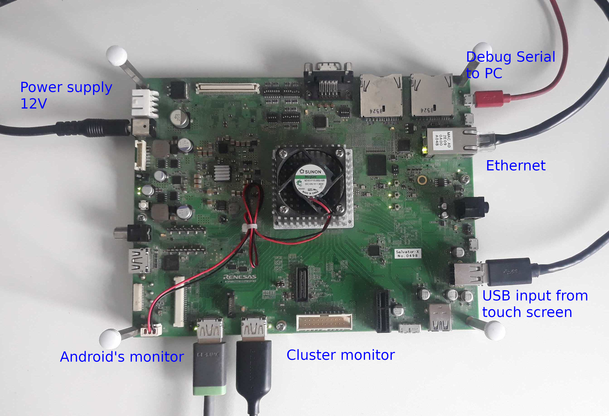

# Connect cables to Salvator X, XS

Connect cables as follow:
```
Micro USB cable from PC        - Debug Serial0
Ethernet cable                 - LAN
USB input from touch screen    - USB 2.0 Type A ch2 (upper)
Cluster monitor (no touch)     - HDMI0 Out
Android's monitor (with touch) - HDMI1 Out
Power supply                   - DC12V
```
Pay attention that both monitors and USB input are required to be connected.

Not connected Ethernet results in significant delay of Android's start.

Micro USB cable is not required and used for obtaining logs.


