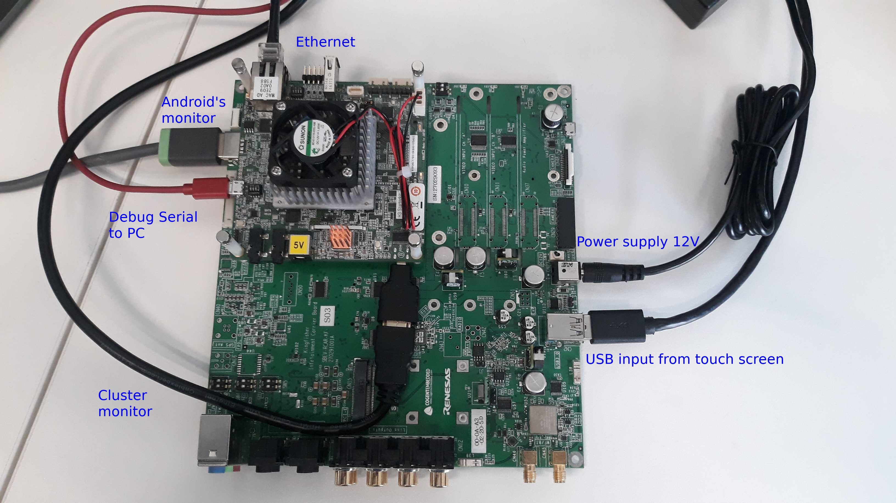

# Connect cables to StarterKit + KingFisher

We use following abbreviation in following text:
- SK - StarterKit see https://elinux.org/R-Car/Boards/H3SK for detailed photo with signed connectors
- KF - KingFisher see https://elinux.org/R-Car/Boards/Kingfisher for detailed photo with signed connectors

**IMPORTANT NOTE**: If SK is mounted onto KF, you have to use 12V power supply and connect it to KF. Power connector on SK is not used in such configuration.

Connect cables as follow:
```
Micro USB cable from PC        - Debug Serial on SK
Ethernet cable                 - LAN on SK
USB input from touch screen    - USB 3.0 on KF (upper or lower)
Cluster monitor (no touch)     - micro HDMI on SK
Android's monitor (with touch) - HDMI Out on KF
Power supply                   - Power +12V on KF
```
Pay attention that both monitors and USB input are required to be connected.

Not connected Ethernet results in significant delay of Android's start.

Micro USB cable is not required and is used for obtaining logs.


