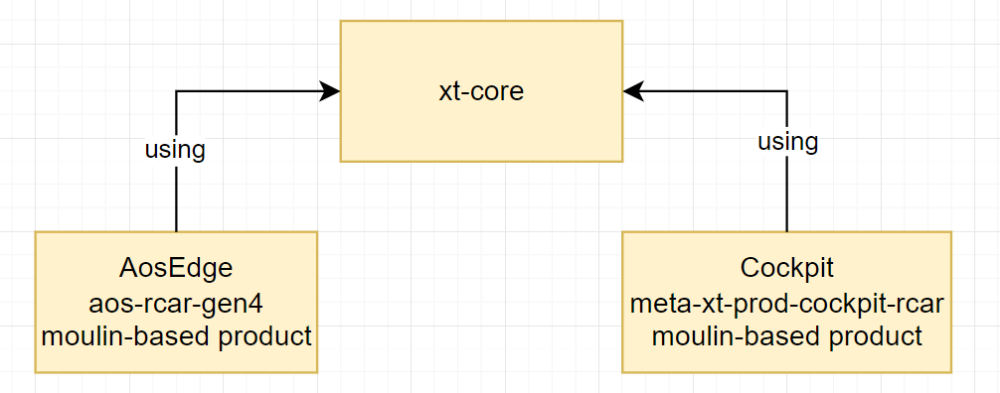

# Release process

Document version: **v1.0.0**

Document status: **Released**

## Table of Contents

- [Overview](#overview)
- [Impacted domains](#impacted-domains)
- [How to create a release?](#how-to-create-a-release)
  - [xt-core](#xt-core)
  - [moulin-based products](#moulin-based-products)
- [Split of responsibilities](#split-of-responsibilities)
- [Example of releasing the moulin-based project](#example-of-releasing-the-moulin-based-project)

## Overview

This document describes release creation rules for the moulin development environment.

The further part of the document is based on the Edge Orchestrator reference project:

**Note!** Do not worry that a specific example is used below. The conclusions from this example have a broader context and can also be applied to other moulin-based products.

## Impacted Domains

Each component we develop in the context of the moulin builds should contain releases. It means that every domain has to freeze their code from time to time:

- repositories with moulin configuration *.yaml files - should have their releases
- repositories with repo manifests, west manifests, and bit-bake recipes - should have their releases
- software component code repositories referenced by all above configurations - should have their releases

But let's think of **higher levels of abstraction** and use more significant entities than git repositories.

In our current practical scenario, we have an Edge Orchestrator reference project that consists of the following high-level components:

- **xt-core** - a set of repositories inside the xen-troops GitHub organization that contains the core build functionality mainly as Yocto layers.
  Note! It is up to xen-troops maintainers to define which repositories will be included in the xt-core abstraction. Currently, the most obvious candidates are listed below:
  - https://github.com/xen-troops/meta-xt-common
  - https://github.com/xen-troops/meta-xt-rcar
  - https://github.com/xen-troops/meta-xt-vhost
  - etc.
- **AosEdge aos-rcar-gen4** - https://github.com/aoscloud/meta-aos-rcar-gen4. Moulin configuration and Yocto layers for R-Car Gen4 AosEdge distro.
- **Cockpit meta-xt-prod-cockpit-rcar** - https://github.com/xen-troops/meta-xt-prod-cockpit-rcar. Reference demo product that implements the Cockpit multimedia system.

In other words, we have **xt-core** base functionality — a reusable huge SW component consisting of multiple parts and moulin builds that want to create their releases relying on the released versions of the xt-core. Making the release means different things for these two types of entities. Let's describe the release process in these two cases.

## How to Create a Release?

### xt-core

- For the xt-core the evolutionary development is used in the **'main'** branch.
- Each xt-core repository's **'main'** branch uses [semantic versioning](https://semver.org) to create release tags, such as v1.1.1, v2.2.2, etc.
- In case of the need to make the release tag on the non-main branch, we use 'yocto way' labeling - **'<branch_name>-<release_version>'**. For example, if the release 'v1.1.1' needs to be created on the 'main' and 'dunfell' branches, besides tag 'v1.1.1' on the 'main' branch, the tag 'dunfell-v1.1.1' should be created on the 'dunfell' branch.
- Only repositories directly referenced by the products in the moulin configuration *.yaml files are placed inside the **'xt-core'** entity. Those repositories are:
  - xt-common - https://github.com/xen-troops/meta-xt-common
  - xt-rcar - https://github.com/xen-troops/meta-xt-rcar
  - xt-rpi5 - https://github.com/xen-troops/meta-xt-rpi5
  - xt-vhost - https://github.com/xen-troops/meta-xt-vhost

  This is necessary so that products can reference these repositories by their release tags - v1.0.0, v2.1.0, etc. For example:

  - type: git
  - url: https://github.com/xen-troops/meta-xt-common.git
  - rev: v1.0.0

- All other xen-troops repositories that get into the product through the above-mentioned **xt-core** repositories will be referenced in the Bitbake recipes using the commit IDs or the release tags ( or branches ) based on community-based naming. **This means no default usage of the Bitbake 'SRCREV = "${AUTOREV}"'!**

  Such repositories are:

    - backends
    - xen
    - linux
    - optee-os
    - many others.

  If necessary, the commit IDs for such repositories are taken from a particular version of **xt-core**. The not **xt-core** repositories are not released without a real need and do not receive a release tag as in **xt-core**, to avoid unnecessary accumulation of tags without changes for years and to avoid duplicating community versioning. That means that:

  - for **snd_be**, the commit ID should be used
  - while for **xen** / **linux** / **optee-os**, the corresponding community versions or xen-troops branches should be used with **???-xt-???** naming.

- Commits to **xt-core** are merged into the **'main'** branch based on evolutionary edits.
- Additional branches in **xt-core** repositories can be temporarily created to meet the developer's needs.

  **Finally, such branches should be merged into the main branch or closed!**
- The tag version of the **xt-core** entity changes only if the commit to a specific **xt-core** repository breaks the compilation or runtime functioning when used with other **xt-core** repositories; that is, the change requires edits in several **xt-core** repositories at once.

  **Example**. We have the xt-core **'v2.1.0'** release tag. As part of the new feature, we made some changes in **meta-xt-rcar** and **meta-xt-common**. Now, **meta-xt-rcar** will no longer compile with an older baseline of the **meta-xt-common**. In such a case, all **xt-core** repos receive the tag **v3.0.0** after this change. So, it is clear to all clients that if they want to get some of the **'v3.0.0'** **xt-core** features, they must switch ALL **xt-core** repositories at least to the **'v3.0.0'** tag.
- Suppose **xt-core** is already on version **v2.0.0**, and a bug is found in **v2.0.0**. I.e., it manifested itself in the **product** **v8.0.0** based on **v2.0.0**. In such a case, the bug fix goes as a commit to the **'main'** branch of **xt-core**, and the fixes needed for a specific **product** go to the **v.8.0.1** of the product's release branches in the form of .bbappend or patches on c/c++ code, which is changed in the baseline **AFTER** the **xt-core v2.0.0**.

**Note!** Changes to essential components, such as the **Xen**, may require an increment of the **xt-core** release tag.
**Note!** Files of version history and release notes should be included in the release with a description like: *"For xt-core v2.0.0, the product should set the following variables for dom0, domD, etc. And stop using these variables - X, Y, Z, etc."*
**Note!** Some README.md containing the current affairs is needed. The specification of all supported configuration variables the product should set for target domains, information regarding which variables have default values, etc.

It leads us to need a separate 'xt-core' repository that will be the entry point into the xt-core repo system. It will not have code but documentation on which repositories and variables to set.

### moulin-based products

- **Approach #1**:
  - Each **MAJOR** release should be represented as a separate release branch.

    **NO** - having a set of tags in your main branch is not enough!
  - If you have a set of repositories released as one entity, use the same release branch name for all the related repositories.
  - Git tags should be used, but they should be used to identify the **MINOR/PATCH** releases.
- **Approach #2**:
  - Development is done in the 'development' branch. In this branch, all dependencies can stick to the HEAD.
  - Release is done using a single separate branch. You can call it 'main' or 'release'.
  - The release is created by:
    - Merging the 'development' branch into the 'main' branch
    - Adding the commit that locks all the dependencies
    - Assigning the release tag to the HEAD commit of the 'main' branch
- Please consider that for **LTS releases**, ONLY variation of the **Approach #1** is applicable. Separate branch for each major **LTS release** and tags usage for dedicated minor/patch versions.
- Release names should incorporate the [semantic versioning](https://semver.org)
- The release should contain **ALL your dependencies LOCKED** on a specific 'release tag' of the dependency SW components.

  It means that:
  - If the SW component you release contains a moulin-based project, you should lock all 'rev:' sections inside the moulin *.yaml configuration file. That includes all supported fetcher types — git, west, repo, etc.
  - If the SW component you release contains a set of Yocto layers, you should lock revisions in the underlying bit-bake recipes on a specific release candidate tag from a corresponding release branch.
  - If the SW component you release contains a repo manifest, you lock all the contained projects inside the *.xml manifest on a specific release candidate tag from a corresponding release branch.
  - If the SW component you release contains a west manifest, you lock all the contained projects inside the west.yml on a specific tag from a corresponding release branch.

  There will be cases ( especially at the beginning of this process's application) where some of the used components will have no release branches or tags. In this case, you can stick to specific commit IDs without the release availability as a workaround. **However, at the final point, all components developed by EPAM as part of the moulin-based products must apply the above process.**
- For every "release entity", we will need to develop and apply a checklist - what actions should be performed to consider the release as done.
- For every "release entity", we will need to define the release schedule - the frequency of introducing new releases.

## Split of Responsibilities

**xt-core**, **AosEdge**, **Cockpit** and even **your own moulin-based product** should be developed independently from the release perspective.

**=> Each development team creates releases based on its schedule, using the above rules.**

## Example of Releasing the Moulin-based Project

Let's imagine that we want to create a release for **AosEdge aos-rcar-gen4**. What scenarios might occur when using a specific release of the **xt-core**?

- You want to stick to an existing specific release of the **xt-core** for your release. In this case, switch all repositories of the **xt-core** you use for your product to the corresponding 'release branch + release candidate tag'.
- You want to stick to an existing specific release of the **xt-core** for your release, but you need several specific patches on top of the release baseline that are not intended to be included in the used **xt-core** release. In this case, you should consider the following options:
  - For the Yocto-based part of the **xt-core** add **meta-xt-core-fixups** layer to your product and overwrite whatever you need. That can include usage of the .bbappend files, bbmask, source code patches, and priority overrides.
  - You can still fall back on creating forks for repo manifests, west manifests, and source code of the SW components that Bitbake does not handle.

  **Note!** This point aims to avoid creating additional branches on the **xt-core** side if some other domain needs to deviate slightly from a release baseline.

What would it mean for the **AosEdge aos-rcar-gen4** to create a release that is using **Approach #2**?

- Move all required changes from the **'develop'** into the **'main'** branch
- With an additional commit, freeze revisions in the moulin *.yaml configuration file. Example: https://github.com/aoscloud/meta-aos-rcar-gen4/commit/ce024273433513fb497f8c14b28ad0819917991c
- Please consider the application of points from the previous list regarding usage of the **xt-core**. Freeze on specific release tags instead of commit ID once the xen-troops team develops their first release.
- As part of the same commit, freeze revisions of the dependencies in the Yocto layers that are part of the **meta-aos-rcar-gen4** repository
- Check that you are using a release of **aoscloud/meta-aos** that properly freezes all its dependencies on the Bitbake level. If there is no proper release of the **aoscloud/meta-aos**, create one first and then use it in the context of the **meta-aos-rcar-gen4** repository.
- Do the same checks for the **aoscloud/aos_core_zephyr**.
- Validate the resulting build using smoke tests. If everything works as expected, assign a release candidate tag to the HEAD of your **'main'** branch.
- Notify others about the new release through the selected communication channel ( Teams channel, email, etc. )
